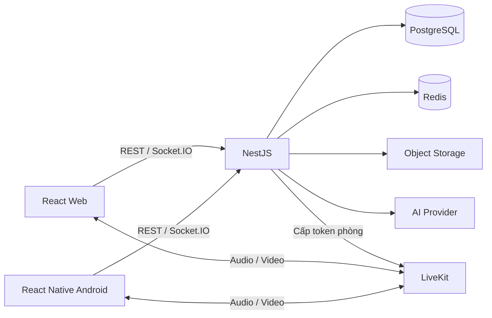

# Kiến trúc và dữ liệu đề xuất

## Kiến trúc

Dùng backend NestJS dạng modular monolith cho bản đồ án, chia module rõ ràng để dễ kiểm thử và vận hành. PostgreSQL giữ dữ liệu bền vững; Redis phục vụ trạng thái tạm thời và phối hợp realtime khi mở rộng. Web và Android dùng chung API và kiểu hợp đồng.

Socket.IO xử lý chat, presence và lời mời cuộc gọi. LiveKit xử lý kết nối/media của phòng; không tự thiết kế thêm một lớp trao đổi SDP/ICE trùng lặp. Cần xác minh SDK và cấu hình LiveKit theo tài liệu chính thức trước khi cài đặt.

## Module

`auth`, `users`, `friendships`, `conversations`, `messages`, `attachments`, `calls`, `notifications`, `ai`, `reports`, `admin`, `audit`, `health`.

## Mô hình dữ liệu sơ bộ

| Bảng | Trường chính và ràng buộc |
| --- | --- |
| users | id, email chuẩn hóa unique, password_hash, display_name, avatar_key, role, status, timestamps |
| sessions | id, user_id, refresh_token_hash, expires_at, revoked_at |
| friendships | id, requester_id, recipient_id, status; không tự kết bạn, unique cặp user không phân biệt thứ tự |
| conversations | id, type direct/group, title, creator_id; direct_pair_key unique cho hội thoại 1-1 |
| conversation_members | conversation_id + user_id unique, role, joined_at, left_at, last_read_message_id |
| messages | id, conversation_id, sender_id, client_message_id, sequence, body, type, created_at, edited_at, deleted_at |
| message_receipts | message_id + user_id unique, delivered_at, read_at |
| attachments | id, uploader_id, message_id nullable, object_key unique, mime_type, size, status |
| calls | id, conversation_id, initiator_id, room_name unique, type, status, started_at, ended_at |
| call_participants | call_id + user_id unique, invited_at, joined_at, left_at, status |
| device_tokens | id, user_id, platform, token unique, revoked_at |
| notifications | id, user_id, type, payload, read_at, created_at |
| ai_jobs | id, user_id, conversation_id nullable, kind, status, input_range, output, error_code, timestamps |
| reports | id, reporter_id, target_type, target_id, reason, status, reviewer_id |
| audit_logs | id, actor_id, action, target_type, target_id, metadata đã lọc, created_at |

ID công khai dùng UUID; thời gian lưu UTC. Cần ERD và migration cụ thể trước khi viết repository. Index messages theo `(conversation_id, sequence)`; unique `(sender_id, client_message_id)` để retry không tạo bản sao và unique `(conversation_id, sequence)` cho thứ tự đồng bộ. Cấp sequence trong transaction có khóa/counter, không dùng `MAX + 1` thiếu khóa.

## Quy tắc bắt buộc khi triển khai

- Kiểm tra tư cách thành viên cho mọi API, sự kiện và yêu cầu token gọi phòng; room Socket.IO không thay thế phân quyền.
- Lưu tin nhắn thành công trước ACK. Dùng outbox hoặc cơ chế đồng bộ bù để xử lý lỗi sau commit nhưng trước broadcast.
- Reconnect lấy tin từ cursor/sequence đã nhận, loại trùng theo ID; định nghĩa chính sách xem lịch sử sau khi rời/được thêm vào nhóm.
- Presence có TTL và đếm phiên/thiết bị. Một thiết bị mất kết nối không làm người dùng offline nếu còn thiết bị khác.
- Web ưu tiên refresh cookie HttpOnly; Android lưu bí mật bằng kho bảo mật hệ điều hành. Token refresh được băm, luân chuyển và có thể thu hồi.
- Tài khoản bị khóa phải mất quyền API, socket và cấp token gọi mới; xử lý phiên gọi đang tồn tại qua API media server.
- Bucket tệp riêng tư, URL ký có hạn; xác thực quyền khi tải xuống và hoàn tất upload. Kiểm tra kích thước, loại thực tế và tên tệp.
- Khóa AI và bí mật LiveKit chỉ ở backend. Người dùng chủ động yêu cầu tác vụ AI; giới hạn dữ liệu gửi, thời gian chờ và chi phí. Nội dung hội thoại là dữ liệu không tin cậy, không được điều khiển công cụ hay vượt quyền người gọi.
- Live Captions cần cơ chế đồng ý, chính sách lưu âm thanh/transcript và hỗ trợ tiếng Việt được kiểm thử thực tế.

## Giao diện cần phác thảo

Đăng nhập/đăng ký; danh sách chat; chi tiết chat; tạo/quản lý nhóm; bạn bè; hồ sơ; cuộc gọi đến/đang gọi; lịch sử gọi; trợ lý AI; quản trị tài khoản/báo cáo/thống kê. Mỗi màn hình cần trạng thái loading, trống, lỗi, mất mạng và quyền bị từ chối.
